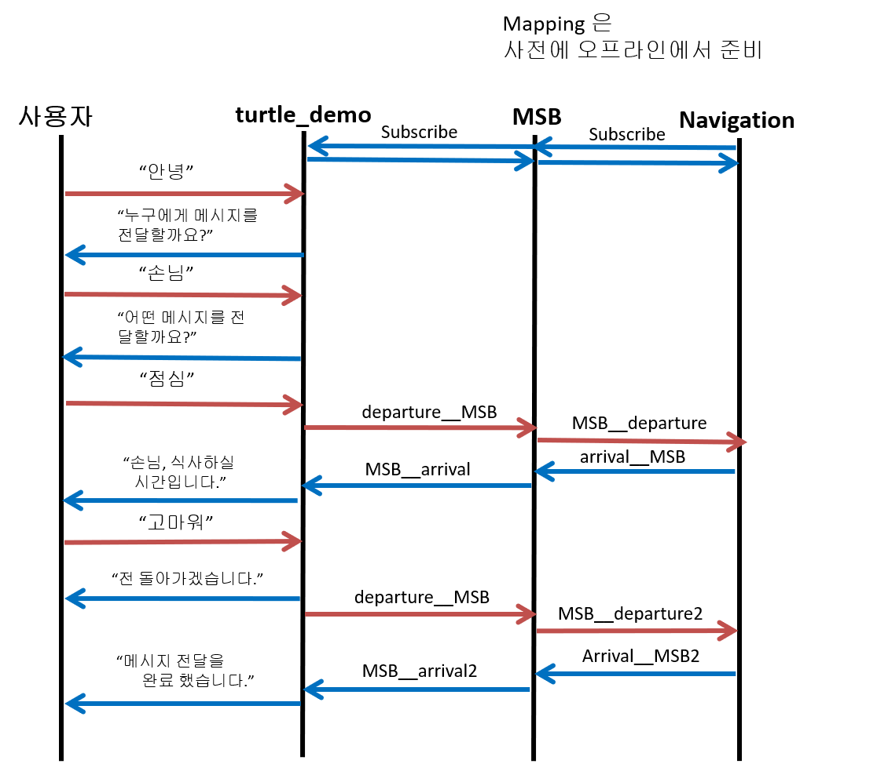
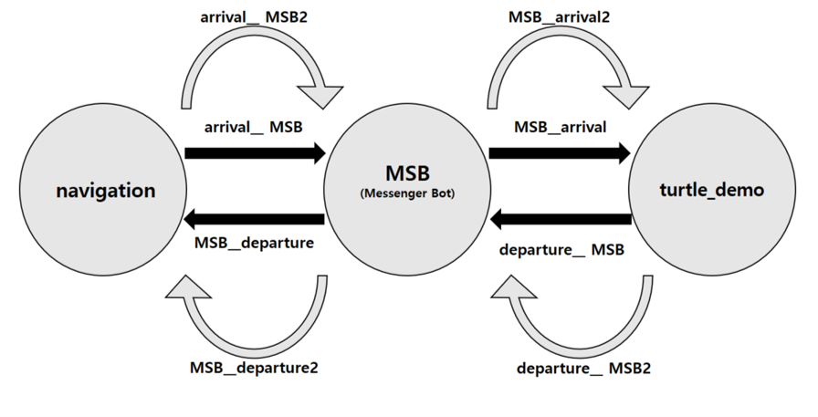

# MSB
Messenger Bot Project (2017.02)
[[VIDEO](https://www.youtube.com/watch?v=fgXrmwN3tbE)]  

### 기존 활용 패키지/ 노드   
(GMapping, ROSpeex, Gazebo, Tutlebot2)
* Turtle_demo Node   
  * 기능 : Voice Recognition, Voice Activity Detection, Noise Reduction ..
  * 사용자로부터 Text를 받은 후, 서버로부터 해당 음성 파일을 받아 발화   
  * 실행 조건 : 이용 가능한 클라우드 서버
  
* Navigation Node  
  * 기능 : 주어진 목표 지점으로 Navigation

* Mapping Package
  * 기능 : Map을 Mapping하는 과정에서 사용.
  
### 신규 개발 패키지/ 노드 
* MSB(Messenger Bot) Node
  * 음성 인식, 합성 노드와 가상 로봇 등 전체 노드 간의 데이터 이동을 담당하는 Server역할의 노드

### Team
* [Lee JaeYun](https://github.com/jaeyun95)
* [Hwang Jisu](https://github.com/yellowjs0304)
* Cho Byeong Ho

### Sequence Diagram
  
   
   
### Topic Diagram
  
